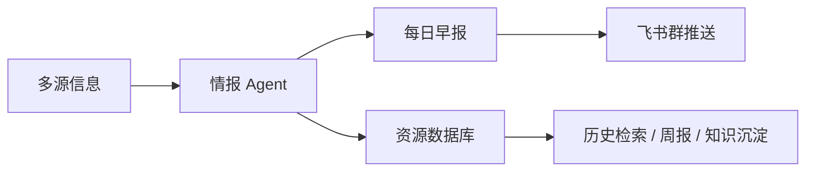
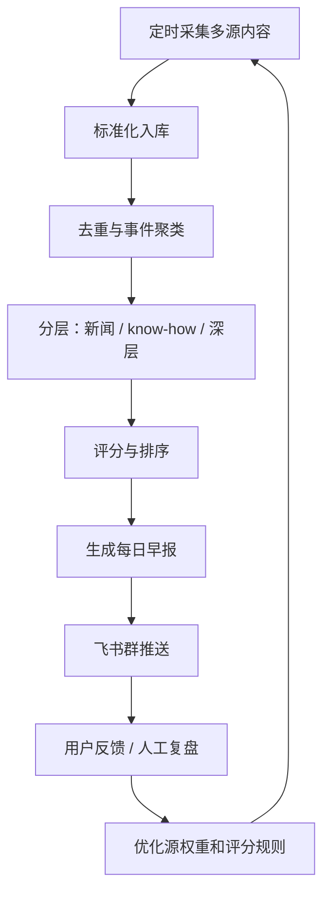
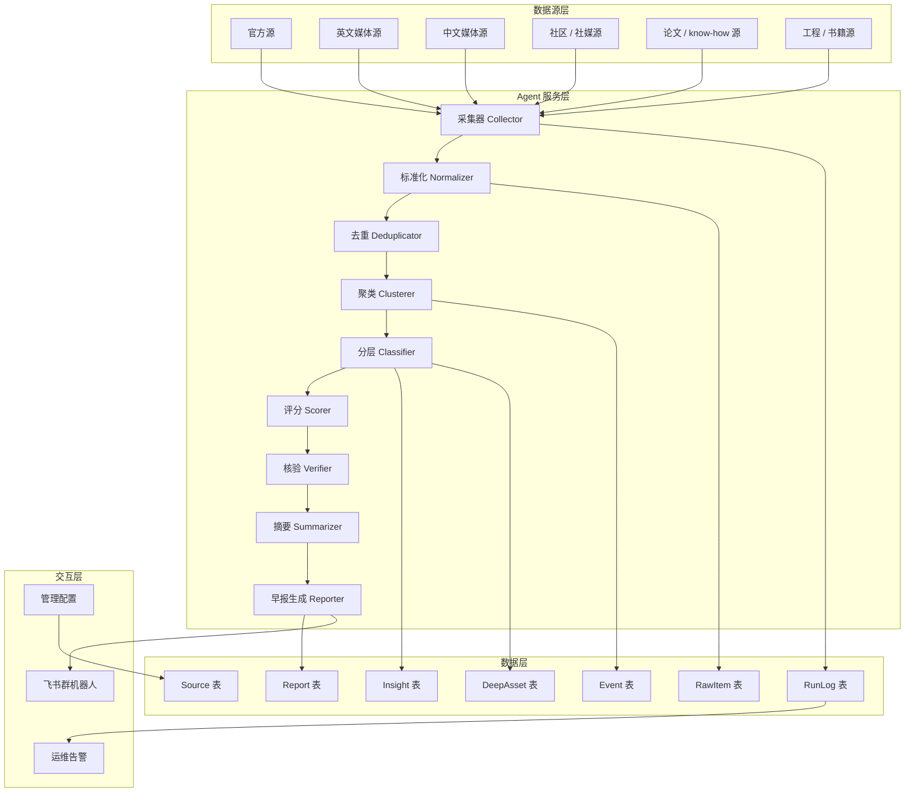

# News PRD

## 0. 封面信息

| 项目 | 内容 |
| --- | --- |
| 产品名称 | AI 情报早报 Agent |
| 文档版本 | v1.0 草稿 |
| 日期 | 2026-06-25 |
| 产品负责人 | @liu xiaoyu @千 @yufan zhang |
| 评审对象 | 产品 / 研发 / 算法 / 运营 / 业务使用方 |
| 一句话定位 | 面向 AI 从业者和项目团队，在飞书群中自动推送每日 AI 早报，并将新闻、know-how、论文、工程项目、书籍等资源结构化沉淀到数据库。 |

---

# 相关材料

**分工：**

**成员 俞凡：数据抓取层**

**成员 晓宇：数据分析层**

**成员 千楠：数据存储 + 飞书调度部署层**

[参考项目](https://app.notion.com/p/38bd6fd653bd80438804d5431a60ccb3?pvs=21)

[信息源 （抓取测试结果在最后）](https://app.notion.com/p/38bd6fd653bd80fe8c2ae83cc304a921?pvs=21)

[技术细节](https://app.notion.com/p/38bd6fd653bd80ffb67dcd785fc3c5bc?pvs=21)

# 目录

---

## 1. 产品定位

AI 情报早报 Agent 是一个接入飞书群的自动化信息筛选与推送系统。它每天从多类信息源中采集 AI 相关内容，对内容进行去重、聚类、分层、评分、摘要和沉淀，最终在每天早上向飞书群推送一份结构化早报。

早报内容分为三层：

| 层级 | 内容类型 | 典型来源 |  | 每日要求 | 产品定位 |
| --- | --- | --- | --- | --- | --- |
| 浅层 | 新闻 | 官方源:OpenAI Anthropic、Google DeepMind NVIDIA、英文媒体:TechCrunch AI、The Verge AI、中文媒体 / 公众号:机器之心、36氪 AI、InfoQ   AI社媒 / 社区:X Lists、LinkedIn 公司页、Hacker News、Product Hunt、GitHub Trending | \ | 每天必须有，5–8 条 | 解决“今天发生了什么”的信息同步问题，让团队快速掌握行业动态和重要信号 |
| 中层 | 行业 know-how / 优秀论文 | 技术博客、行业研报 深度文章、Hugging Face、arXiv、GitHub、InfoQ、机器之心、量子位、技术公众号 |  | 每天必须有，1–3 条 | 解决“哪些内容值得学习和借鉴”的问题，从信息中提炼可复用的方法和判断 |
| 深层 | 值得实践的工程 / 奠基性论文 / 书籍 | GitHub 高质量仓库、经典论文、官方文档、技术书籍、课程、权威报告、标准组织文档 |  | 每天过滤并入库，不强制每天推送 | 解决“什么值得长期沉淀和反复实践”的问题，为团队形成可积累的知识资产库 |

核心不是“抓更多信息”，而是“筛出值得团队看、值得后续沉淀的信息”。

### 1.1 产品形态：Feishu 群机器人 + 情报 Agent + 资源数据库

产品由三部分组成：

| 模块 | 说明 |
| --- | --- |
| Feishu 群机器人 | 每天定时向指定飞书群推送 AI 早报 |
| 情报 Agent | 负责采集、去重、聚类、评分、摘要、核验和生成早报 |
| 资源数据库 | 每天保存采集到的新闻、论文、文章、工程项目、书籍等资源，支持后续复盘和检索 |

推荐产品形态：



---

## 2. 背景与问题

AI 行业信息密度极高，团队每天需要同时关注模型更新、产品发布、投融资、政策监管、优秀论文、工程项目和长期学习资料。但这些信息分散在多个渠道中，人工处理成本高，且质量参差不齐。

| 问题 | 具体表现 | 影响 |
| --- | --- | --- |
| 信息源分散 | 官方博客、微信公众号、X、GitHub、论文平台、公众号、社区分布零散 | 人工巡检成本高，每天可能需要 30–60 分钟 |
| 新闻重复严重 | 同一事件会被官方、英文媒体、中文媒体、社媒多次报道 | 群里容易出现重复转发 |
| 官方源可信但不一定重要 | 官方博客可能发布客户案例、活动信息、营销内容 | 不能直接按官方源排序 |
| 中层内容难筛 | 技术文章、行业 know-how、论文质量不一 | 团队难判断哪些值得读 |
| 深层内容需要沉淀 | 工程项目、经典论文、书籍不是每天都有，但需要持续发现 | 容易错过长期价值资源 |
| 群内信息不可沉淀 | 飞书群消息流过即走，难以后续检索 | 缺少结构化资源库 |

因此，本产品需要解决两个核心问题：

1. 每天自动生成一份高质量 AI 早报。
2. 每天把采集到的资源结构化存入数据库，逐步形成团队 AI 情报库。

---

## 3. 核心目标

### 3.1 产品目标

| 优先级 | 目标 | 说明 |
| --- | --- | --- |
| P0 | 每天稳定推送 AI 早报 | 每天早上固定时间发送到飞书群 |
| P0 | 浅层新闻必须覆盖 | 每天输出 5–8 条重点新闻 |
| P0 | 中层内容每天输出 | 每天输出 1–3 条 know-how / 优秀论文 |
| P0 | 所有资源入库 | 每天采集到的资源都要结构化保存 |
| P1 | 深层内容持续过滤 | 不强制每天推送，但每天进入候选池评分 |
| P1 | 多源聚类去重 | 同一事件只在早报中出现一次 |
| P1 | 可追溯来源 | 每条重点内容必须带来源链接 |
| P2 | 支持历史检索 | 后续可按主题、来源、时间、层级查询 |

### 3.2 核心闭环

产品闭环不是“采集 → 推送”这么简单，而是“采集 → 筛选 → 推送 → 沉淀 → 反馈 → 优化”。

> v1.0 阶段，系统优先保证所有有效资源自动入库和每日早报稳定推送，人工反馈不作为入库前置条件，也不直接影响推荐结果。v1.1 阶段，引入点赞、收藏、Star 等正向反馈，将多人反馈聚合到资源维度，形成资源价值标记。对反馈数据进行复盘和离线验证，判断其是否能稳定提升内容质量。v2.0 阶段，再将经过验证的反馈信号纳入推荐和排序策略，同时保留规则兜底和人工复盘机制，避免少数反馈直接影响全局推送。
> 



### 3.3 成功标准

| 指标 | 目标值 |
| --- | --- |
| 早报推送准时率 | 每天 08:00 前推送，成功率 ≥ 95% |
| 浅层新闻数量 | 每天 5–8 条 |
| 中层内容数量 | 每天 1–3 条 |
| 深层内容处理 | 每天至少完成一次过滤和入库，不强制推送 |
| 资源入库完整率 | 采集成功内容 100% 入库 |
| 重复事件控制 | 早报中重复事件 ≤ 1 条 |
| 来源链接覆盖率 | 重点内容来源链接覆盖率 100% |
| 摘要事实准确率 | 人工抽检准确率 ≥ 90% |
| 单次早报阅读时长 | 控制在 3–5 分钟 |
| 系统可用性 | 工作日稳定运行率 ≥ 95% |

---

## 4. 使用对象

不同用户角色对早报内容的关注点不同，例如技术团队更关注论文、工程项目和技术实践，业务或投资相关角色更关注公司动态、融资、政策和商业化进展。因此，长期来看，按角色或主题区分信息流是有价值的。

但考虑到 v1.0 阶段主要面向公司内部团队使用，用户规模较小，且核心目标是先跑通每日早报主链路，因此 v1.0 暂不做用户级个性化推荐。系统先输出一份统一早报，通过固定栏目结构兼顾不同角色的信息需求。后续版本再逐步引入主题分组、角色偏好和多群订阅能力。

| 版本 | 用户区分策略 | 数据抓取层 | 数据分析层 | 数据存储层 |
| --- | --- | --- | --- | --- |
| v1.0 | 不做用户级区分，统一输出一份团队早报 | 使用统一核心源池，覆盖官方源、媒体源、社区源、论文/工程源 | 使用统一评分规则，按三分层输出 | 不区分用户，只存资源、标签、来源、评分和报告 |
| v1.1 | 做轻量主题区分，不做个人推荐 | 在统一源池基础上补充主题源，如技术、产品、商业、政策、融资 | 在摘要中增加主题标签，如“技术 / 产品 / 商业 / 政策 / 工程” | 增加主题标签字段，但不需要改变核心表结构 |
| v2.0 | 支持角色化 / 多主题订阅 | 根据不同角色维护不同主题源池或源权重 | 基于角色提示词、主题权重和反馈信号生成差异化推荐 | 资源表继续复用，新增用户偏好、主题订阅、反馈记录即可 |

## 5. 核心场景

### 5.1 场景一：每日 AI 新闻早报推送

| 项目 | 内容 |
| --- | --- |
| 输入 | 过去 24 小时 AI 相关新闻、官方公告、媒体报道、社区讨论 |
| 流程 | Agent 采集内容 → 聚类为事件 → 打分排序 → 生成摘要 → 推送飞书 |
| 输出 | 飞书群收到 5–8 条重点 AI 新闻 |
| 成功标准 | 每条新闻包含标题、一句话摘要、为什么重要、来源链接 |

示例输出：

```
1. OpenAI 发布 Codex 相关更新
一句话：OpenAI 对 Codex 的能力和使用方式进行了更新。
为什么重要：该更新可能影响 AI 编程 Agent 的产品形态和开发者工作流。
来源：OpenAI News / TechCrunch
```

### 5.2 场景二：行业 know-how / 优秀论文筛选

| 项目 | 内容 |
| --- | --- |
| 输入 | 行业深度文章、技术博客、优秀论文、工程经验、benchmark 解读 |
| 流程 | Agent 判断内容是否具备学习价值 → 评分 → 摘要 → 进入早报中层栏目 |
| 输出 | 每天 1–3 条值得学习的中层内容 |
| 成功标准 | 每条内容说明“适合谁看”和“可借鉴点” |

中层内容不是普通新闻，而是能帮助团队形成理解的内容，例如：

| 类型 | 示例 |
| --- | --- |
| 行业 know-how | Agent 产品设计方法、AI 应用商业化经验 |
| 技术 know-how | RAG 架构实践、模型评测方法、推理成本优化 |
| 优秀论文 | 被社区广泛讨论、对 Agent / LLM / 多模态有启发的论文 |
| 工程经验 | 某团队如何落地 AI coding workflow |

### 5.3 场景三：深层资源每日过滤与沉淀

| 项目 | 内容 |
| --- | --- |
| 输入 | GitHub 项目、经典论文、技术书籍、长期资源清单 |
| 流程 | Agent 每天扫描并评分 → 存入 DeepAsset 候选池 → 达阈值才推送 |
| 输出 | 不一定每天推送，但每天完成过滤和入库 |
| 成功标准 | 深层资源不为凑数推送，必须有长期价值理由 |

深层资源判断标准：

| 维度 | 判断方式 |
| --- | --- |
| 工程可实践性 | 是否能部署、是否有文档、是否有真实案例 |
| 长期价值 | 是否不是短期热点，是否适合反复学习 |
| 影响力 | Star 增长、引用量、社区讨论、权威推荐 |
| 适配性 | 是否与团队关注方向相关 |
| 成熟度 | 是否维护活跃、issue 响应、版本稳定 |

### 5.4 场景四：历史资源检索与复盘

| 项目 | 内容 |
| --- | --- |
| 输入 | 用户想回顾某主题，如“AI Agent”“机器人”“推理成本”“OpenAI” |
| 流程 | 从数据库按标签、来源、时间、层级查询 |
| 输出 | 历史新闻、论文、文章、工程项目列表 |
| 成功标准 | v1.0 先完成入库，v1.1 支持基础检索 |

---

## 6. 系统设计

### 6.1 总体架构



### 6.2 核心组件

| 组件 | 职责 | 输入 | 输出 |
| --- | --- | --- | --- |
| Source Manager | 管理信息源、权重、状态 | 源配置 | 可用源列表 |
| Collector | 定时采集 RSS、网页、API 内容 | Source URL | RawItem |
| Normalizer | 统一字段格式 | 原始内容 | 标准化 RawItem |
| Deduplicator | URL、标题、hash 去重 | RawItem | 去重内容 |
| Clusterer | 多篇内容聚类为一个事件 | RawItem | Event |
| Classifier | 判断内容层级 | Event / RawItem | 新闻 / know-how / 深层 |
| Scorer | 计算重要性和优先级 | 内容对象 | score、reason |
| Verifier | 核验高分事件来源 | 高分事件 | 核验状态 |
| Summarizer | 生成中文摘要 | 内容和来源 | 结构化摘要 |
| Reporter | 拼装每日早报 | 候选内容 | Report |
| Feishu Sender | 发送飞书消息 | Report | 推送结果 |
| Database Writer | 将资源写入数据库 | 所有采集内容 | 持久化记录 |
| Logger | 记录运行状态 | 任务事件 | 日志和告警 |

### 6.3 部署与自动更新

| 项目 | 设计 |
| --- | --- |
| 调度方式 | 每天 06:30 开始采集，08:00 前推送 |
| 部署方式 | v1.0 可部署在云服务器 / GitHub Actions / 本地定时任务 |
| 数据库 | MVP 可用 SQLite，正式版建议 PostgreSQL |
| LLM 调用 | 用于摘要、分类、评分解释，不直接作为唯一判断依据 |
| 飞书接入 | v1.0 使用飞书群机器人 Webhook |
| 自动更新 | 每日定时任务自动运行；源配置支持手动更新 |
| 失败重试 | 采集失败重试 2 次，推送失败重试 3 次 |
| 日志保存 | 至少保存 30 天运行日志 |

推荐每日时间线：

| 时间 | 动作 |  |
| --- | --- | --- |
| 06:30 | 启动采集任务 |  |
| 06:30–07:00 | 抓取信息源并入库 |  |
| 07:00–07:30 | 去重、聚类、分层 |  |
| 07:30–08:00 | 评分、核验、摘要 |  |
| 08:00–08:20 | 生成早报 |  |
| 08:30 | 飞书群推送 |  |
| 09:00 | 若失败，发送运维告警 |  |

### 6.4 协作模型

| 角色 | 权限 | 说明 |
| --- | --- | --- |
| 群成员 | 查看早报、反馈有用性 | 不可修改配置 |
| 产品负责人 | 修改源、修改评分规则、查看数据 | 负责内容质量 |
| 研发负责人 | 查看日志、维护任务、修复异常 | 负责系统稳定 |
| 运营人员 | 补充源、整理专题、复盘内容 | 负责信息源质量 |
| 管理员 | 配置飞书机器人、数据库、密钥 | 负责权限和安全 |

---

## 7. 功能需求

| 编号 | 模块 | 优先级 | 需求说明 |
| --- | --- | --- | --- |
| FR-01 | 信息源配置 | P0 | 支持配置源名称、URL、类型、语言、权重、启用状态 |
| FR-02 | 定时采集 | P0 | 每天自动抓取配置源中的新增内容 |
| FR-03 | 内容标准化 | P0 | 统一标题、链接、来源、时间、摘要、正文、标签 |
| FR-04 | 数据库存储 | P0 | 所有采集到的资源必须入库，包括未进入早报的内容 |
| FR-05 | URL 去重 | P0 | 相同 URL 只保存一条主记录 |
| FR-06 | 事件聚类 | P0 | 将多个来源报道的同一事件合并 |
| FR-07 | 内容分层 | P0 | 自动分类为新闻、know-how / 论文、深层资源 |
| FR-08 | 新闻评分 | P0 | 根据来源、多源确认、热度、主题相关性评分 |
| FR-09 | 中层评分 | P0 | 根据知识密度、可迁移性、专业性评分 |
| FR-10 | 深层过滤 | P0 | 每天扫描深层候选，不强制推送 |
| FR-11 | 高分核验 | P0 | 进入早报的重点新闻必须核验来源 |
| FR-12 | LLM 摘要 | P0 | 生成中文摘要、重要性说明、建议关注点 |
| FR-13 | 早报生成 | P0 | 按固定模板生成每日早报 |
| FR-14 | 飞书推送 | P0 | 通过飞书机器人发送早报 |
| FR-15 | 失败重试 | P0 | 采集和推送失败需自动重试 |
| FR-16 | 运维告警 | P0 | 早报失败、内容不足、核心源失败需告警 |
| FR-17 | 历史报告保存 | P1 | 保存每日早报内容，支持后续查看 |
| FR-18 | 源质量统计 | P1 | 统计每个源的有效内容数量和入选率 |
| FR-19 | 用户反馈 | P1 | 支持群成员反馈“有用 / 无用 / 想看更多” |
| FR-20 | 历史检索 | P2 | 支持按关键词、标签、来源、层级检索数据库 |

数据库核心实体：

| 实体 | 关键字段 |
| --- | --- |
| Source | id、name、url、type、language、weight、enabled、fail_count |
| RawItem | id、title、url、source_id、published_at、fetched_at、content、summary、hash |
| Event | id、title、category、entities、score、priority、verified_status |
| Insight | id、title、type、url、score、reason、summary |
| DeepAsset | id、title、asset_type、url、score、observation_days、evidence |
| Report | id、date、content、status、sent_at |
| RunLog | id、task_name、status、started_at、ended_at、error |

---

## 8. 评分结构生成策略示例

### 8.1 通用评分对象

系统评分对象不是单篇文章，而是四类对象：

| 对象 | 说明 | 是否进入早报 |
| --- | --- | --- |
| RawItem | 原始采集内容 | 默认不直接进入 |
| Event | 新闻事件 | 可进入浅层新闻 |
| Insight | know-how / 优秀论文 | 可进入中层 |
| DeepAsset | 工程 / 奠基论文 / 书籍 | 达阈值才进入深层 |

通用评分维度：

当前评分表为 v1.0 阶段的初始评分框架，主要用于明确系统在筛选内容时需要考虑的方向，不作为最终固定权重。各维度分值会在试运行阶段结合人工评审、历史数据回放和早报质量 benchmark 逐步调整。

v1.0 阶段优先采用“规则评分 + 人工抽检”的方式，保证评分逻辑可解释、可快速迭代。后续版本会根据实际推送效果、用户反馈和内容命中质量，对权重进行校准。

| 维度 | 初始参考分值 | 说明 | 后续校准方式 |
| --- | --- | --- | --- |
| 来源可信度 | 0–25 | 官方源、权威媒体、专业社区加分 | 根据来源入选率、人工质量评分调整 |
| 多源确认 | 0–20 | 多个独立来源报道同一事件加分 | 通过重复事件聚类准确率和误报率调整 |
| 主题相关性 | 0–20 | 是否与 AI、Agent、模型、工程、产业相关 | 通过人工标注样本和主题命中率校准 |
| 热度信号 | 0–15 | GitHub、HN、Reddit、X、媒体讨论等热度 | 根据热度与实际价值的相关性调整 |
| 实践价值 | 0–15 | 是否能带来行动、学习或产品启发 | 结合团队反馈、收藏、Star 等正反馈校准 |
| 新颖性 | 0–10 | 是否是新事件、新方法、新资源 | 结合重复率和历史入库记录校准 |
| 噪音惩罚 | -30–0 | 标题党、营销稿、重复旧闻、弱相关内容扣分 | 根据误推内容复盘持续优化 |

### 8.2 新闻事件评分策略

| 信号 | 加分 |
| --- | --- |
| 官方源出现 | +15 |
| 一线英文媒体报道 | +20 |
| 中文 AI 媒体报道 | +10 |
| 多于 3 个来源共同报道 | +15 |
| 涉及模型、API、Agent、芯片、监管、融资 | +15 |
| Hacker News / Reddit / GitHub 有明显讨论 | +10 |
| 只有单一官方营销稿 | -10 |
| 疑似旧闻重复包装 | -20 |

新闻入选规则：

| 分数 | 处理 |
| --- | --- |
| ≥ 80 | 必须进入重点新闻 |
| 60–79 | 候选，按版面选择 |
| 40–59 | 入库，不推送 |
| < 40 | 入库或丢弃，视配置决定 |

### 8.3 know-how / 论文评分策略

| 维度 | 标准 |
| --- | --- |
| 知识密度 | 是否提供方法、框架、经验，而不是泛泛而谈 |
| 可迁移性 | 是否能被团队借鉴到产品、工程或研究中 |
| 可信度 | 作者、机构、引用、社区讨论是否可靠 |
| 时效性 | 是否解决当前 AI 行业真实问题 |
| 解释质量 | 是否有清晰图示、实验、案例或代码 |
| 主题相关性 | 是否与 Agent、LLM、RAG、多模态、AI Infra 等相关 |

中层内容每日要求：

| 项目 | 要求 |
| --- | --- |
| 最少数量 | 1 条 |
| 推荐数量 | 1–3 条 |
| 最低分数 | 65 分 |
| 输出字段 | 标题、核心观点、适合谁看、可借鉴点、来源 |

### 8.4 深层资源评分策略

深层内容不能为了“每天都有”而强行推送。它需要观察和沉淀。

| 类型 | 评分重点 |
| --- | --- |
| 工程项目 | 可运行、文档完善、维护活跃、Star 增长、真实场景可用 |
| 奠基性论文 | 被多次引用、长期影响、方法基础性强 |
| 书籍 | 系统性强、评价稳定、适合长期学习 |
| 课程 / 文档 | 结构完整、持续更新、能形成学习路径 |

深层内容推送规则：

| 条件 | 处理 |
| --- | --- |
| 分数 ≥ 85 且观察 ≥ 3 天 | 可进入早报深层栏目 |
| 分数 70–84 | 继续观察 |
| 分数 < 70 | 仅入库，不推送 |
| 当天无达标内容 | 早报显示“今日暂无达到推送阈值的深层内容” |

---

## 9. 操作形态

### 9.1 飞书群早报形态

早报建议采用飞书卡片或 Markdown 文本。

```
AI 情报早报｜2026-06-25

一、今日重点新闻

1. 标题
一句话：……
为什么重要：……
来源：……
入库状态：已入库
数据库：飞书知识库 / Notion / 内部资源库

二、行业 know-how / 优秀论文

1. 标题
核心观点：……
可借鉴点：……
来源：……
入库状态：已入库
数据库：飞书知识库 / Notion / 内部资源库

三、长期值得沉淀

今日暂无达到推送阈值的深层内容。
今日已过滤并入库深层候选：X 条

四、今日趋势观察

- 趋势 1
- 趋势 2

五、待观察线索

- 线索 1：目前只有社媒讨论，暂未找到官方确认。
  入库状态：已入库，标记为「待观察」
```

| 版本 | 数据库策略 |
| --- | --- |
| v1.0 | 不额外建设独立数据库，优先接入飞书多维表格作为团队主资源库；同步写入 Notion Database |
| v1.1 | 完善飞书与 Notion 的双库同步逻辑，支持去重、状态回写、入库失败重试 |
| v2.0 | 基于飞书 / Notion 中沉淀的数据，支持标签管理、历史检索、周报生成和多人反馈统计 |

### 9.2 后台 / 配置形态

v1.0 可先不做后台，用配置文件维护。

```
sources:
  - name: OpenAI News
    type: official
    url: https://openai.com/news/
    language: en
    weight: 18
    enabled: true

  - name: TechCrunch AI
    type: media
    url: https://techcrunch.com/category/artificial-intelligence/
    language: en
    weight: 20
    enabled: true
```

### 9.3 数据库沉淀形态

每天无论是否推送，都需要保存：

| 内容 | 是否入库 |
| --- | --- |
| 进入早报的新闻 | 是 |
| 未进入早报但达到基础质量线的新闻 | 是 |
| know-how / 论文候选 | 是 |
| 深层工程 / 书籍候选 | 是 |
| 被判定为垃圾的内容 | 可选，默认只存 hash 和原因 |

---

## 10. 质量指标

| 类别 | 指标 | 目标 |
| --- | --- | --- |
| 稳定性 | 早报推送成功率 | ≥ 95% |
| 准时性 | 08:30 前完成推送 | ≥ 95% |
| 新闻覆盖 | 每日浅层新闻数量 | 5–8 条 |
| 中层覆盖 | 每日 know-how / 论文数量 | 1–3 条 |
| 深层过滤 | 每日深层候选处理 | ≥ 1 次 |
| 入库完整性 | 采集内容入库率 | 100% |
| 去重效果 | 重复事件数量 | ≤ 1 条 |
| 来源质量 | 重点内容来源链接 | 100% |
| 摘要质量 | 事实错误率 | ≤ 10% |
| 阅读体验 | 早报阅读时长 | 3–5 分钟 |
| 可维护性 | 新增信息源耗时 | ≤ 5 分钟 |

---

## 11. 失败模式与防护

| 失败模式 | 风险 | 防护措施 |
| --- | --- | --- |
| 信息源抓取失败 | 内容不足 | 单源失败不阻塞整体，连续失败 3 次告警 |
| 飞书推送失败 | 群内收不到早报 | 重试 3 次，仍失败则告警 |
| LLM 摘要失败 | 早报无法生成 | 使用规则模板生成简版早报 |
| 新闻重复 | 用户阅读体验差 | URL 去重 + 标题相似度 + 事件聚类 |
| 社媒谣言进入早报 | 误导判断 | 社媒仅作线索，高分事件必须核验 |
| 官方源营销稿过多 | 内容价值低 | 官方源增加可信度，不直接判定重要 |
| 中层内容凑数 | 降低早报质量 | 设置最低分，不达标则减少数量 |
| 深层内容过度推送 | 长期栏目失真 | 必须观察和达阈值，不强制每日输出 |
| 数据库写入失败 | 历史资源丢失 | 写入失败重试，失败进入本地备份队列 |
| API 成本过高 | 系统不可持续 | 先规则筛选，再对高分内容调用 LLM |
| 内容过长 | 用户不愿阅读 | 限制条数和摘要长度 |

---

## 12. 版本规划与时间表

**数据抓取层-负责人（张俞凡 ）：**

| 版本 | Milestone | 功能点 | 主负责人 | 协作人 | 时间 | 交付物 |
| --- | --- | --- | --- | --- | --- | --- |
| v1.0 | M1：信息源范围与采集接口确认 | 确认首批核心信息源、来源类型、采集字段和 RawItem 输出规范 | 张俞凡 | 刘晓宇、完千楠 | v1.0 周期内并行推进 | 信息源清单 v1、采集字段说明、RawItem 输出样例 |
| v1.0 | M2：基础采集链路跑通 | 接入官方源、英文媒体、中文媒体、社区源等首批核心信息源，完成基础采集与标准化输出 | 张俞凡 | 完千楠、刘晓宇 | v1.0 周期内并行推进 | 首批信息源可采集；采集结果可供分析层消费 |
| v1.0 | M3：源状态与异常处理 | 记录信息源抓取成功 / 失败状态，支持基础失败重试和低质量源标记 | 张俞凡 | 完千楠 | v1.0 周期内并行推进 | 源状态记录、失败源清单、基础重试机制 |
| v1.1 | M4：信息源质量优化 | 根据早报入选率、有效内容比例、失败率等指标优化源池，剔除低质量源 | 张俞凡 | 刘晓宇 | v1.1 周期内完成，预计 1 周 | 信息源清单 v2、源质量评估表、源权重优化建议 |
| v1.1 | M5：中层内容源补充 | 补充 know-how、优秀论文、技术博客、行业深度文章等中层来源 | 张俞凡 | 刘晓宇 | v1.1 周期内完成，预计 1 周 | 中层内容源清单、论文 / 技术博客候选源 |
| v2.0 | M6：深层资源源池建设 | 接入工程项目、经典论文、书籍、课程、长期技术文档等深层资源来源 | 张俞凡 | 刘晓宇 | v2.0 周期内完成，预计 1–2 周 | 深层资源源池 v1、工程 / 论文 / 书籍来源清单 |
| v2.0 | M7：多主题源池扩展 | 按技术、产品、商业、政策、融资、机器人、AI Infra 等主题维护不同信息源分组 | 张俞凡 | 刘晓宇、完千楠 | v2.0 周期内完成，预计 1–2 周 | 多主题源池配置、主题源权重建议 |

---

**数据分析层-负责人（刘晓宇 ）：**

| 版本 | Milestone | 功能点 | 主负责人 | 协作人 | 时间 | 交付物 |
| --- | --- | --- | --- | --- | --- | --- |
| v1.0 | M1：分析层输入输出协议确认 | 确认 RawItem 输入字段、分析层输出字段、三层内容类型、source_type / content_hint 枚举 | 刘晓宇 | 张俞凡、完千楠 | Day 1–2 | RawItem 字段说明、分析层输出结构、测试样本字段规范 |
| v1.0 | M2：去重与基础聚类 | 完成 URL 去重、标题清洗、标题相似度去重、同一事件基础聚类 | 刘晓宇 | 张俞凡 | Day 3–5 | Deduplicator 初版、Clusterer 初版、事件来源合并结果 |
| v1.0 | M3：三层分类与基础评分 | 完成浅层新闻、中层 know-how / 优秀论文、深层资源的分类规则；建立初始评分框架 | 刘晓宇 | 张俞凡 | Day 6–8 | Classifier 初版、Scorer 初版、score_reason 输出 |
| v1.0 | M4：核验与摘要生成 | 完成核验状态设计、高风险内容识别、来源可信度判断；生成新闻 / 中层 / 深层摘要模板 | 刘晓宇 | 完千楠 | Day 9–11 | Verifier 初版、Summarizer Prompt、结构化摘要结果 |
| v1.0 | M5：早报候选生成与联调验收 | 输出今日新闻 Top 5–8、中层 Top 1–3、深层候选、趋势观察、待观察线索，并与推送层联调 | 刘晓宇 | 完千楠、张俞凡 | Day 12–14 | ReportCandidate 结构、早报候选 JSON、人工抽检记录、v1.0 分析层验收结果 |
| v1.1 | M6：反馈数据沉淀 | 记录 Star、收藏、有用、想看更多、人工复盘标签，形成可训练样本 | 刘晓宇 | 完千楠 | v1.0 后第 1 周 | 反馈字段设计、人工复盘标签体系、反馈样本沉淀 |
| v1.1 | M7：评分规则校准 | 根据人工抽检和反馈结果调整来源权重、主题权重、噪音惩罚 | 刘晓宇 | 张俞凡、完千楠 | v1.0 后第 1 周 | 评分规则 v2、权重调整记录、误推 / 漏推复盘 |
| v1.1 | M8：源质量评估 | 统计不同源的入选率、正反馈率、误推率，用于优化信息源权重 | 刘晓宇 | 张俞凡 | v1.0 后第 1 周 | 源质量评估表、信息源权重优化建议 |
| v2.0 | M9：分类模型优化 | 训练 / 微调 news、insight、deep_asset、noise 分类器，提升分层稳定性 | 刘晓宇 | 张俞凡、完千楠 | v1.1 后第 1 周 | 分类模型方案、训练样本集、分类效果评估 |
| v2.0 | M10：排序模型优化 | 基于反馈和复盘标签训练 reranker，用于优化 Top 内容选择 | 刘晓宇 | 完千楠 | v1.1 后第 1 周 | reranker 初版、排序评估结果、线上灰度方案 |
| v2.0 | M11：角色化推荐 | 根据技术、产品、商业、政策等主题权重生成不同视角的内容推荐 | 刘晓宇 | 张俞凡、完千楠 | v1.1 后第 1 周 | 角色标签体系、主题权重方案、多角色推荐策略 |

**数据存储层+推送部署层-负责人（完千楠 ）：**

| 版本 | Milestone | 功能点 | 主负责人 | 协作人 | 时间 | 交付物 |
| --- | --- | --- | --- | --- | --- | --- |
| v1.0 | M1：入库字段与早报展示结构确认 | 确认飞书 / Notion 数据库字段、早报展示字段、入库状态和数据库链接展示方式 | 完千楠 | 刘晓宇、张俞凡 | v1.0 周期内并行推进 | 飞书 / Notion 字段设计、早报展示结构说明 |
| v1.0 | M2：资源自动入库能力 | 将采集和分析后的有效资源写入飞书 / Notion 数据库，支持已入库状态记录 | 完千楠 | 张俞凡、刘晓宇 | v1.0 周期内并行推进 | 资源自动入库能力、入库状态字段、数据库记录链接 |
| v1.0 | M3：早报生成与飞书推送 | 根据分析层输出的 ReportCandidate 生成飞书早报，并推送到指定飞书群 | 完千楠 | 刘晓宇 | v1.0 周期内并行推进 | 飞书早报模板、飞书群推送能力、推送结果记录 |
| v1.0 | M4：定时任务与基础日志 | 建立每日定时运行机制，记录采集、分析、入库、推送的基础状态 | 完千楠 | 张俞凡、刘晓宇 | v1.0 周期内并行推进 | 定时任务、基础运行日志、推送状态记录 |
| v1.0 | M5：MVP 联调与验收 | 贯通采集、分析、入库、早报生成和飞书推送全链路，完成 MVP 验收 | 完千楠 | 张俞凡、刘晓宇 | v1.0 周期内并行推进，整体 2 周内完成 | 联调结果、问题清单、MVP 验收记录 |
| v1.1 | M6：失败告警与稳定性优化 | 对采集失败、分析失败、入库失败、推送失败建立基础告警和重试机制 | 完千楠 | 张俞凡、刘晓宇 | v1.1 周期内完成，预计 1 周 | 告警机制、失败重试策略、稳定性验证记录 |
| v1.1 | M7：历史查询与内容复盘 | 支持按日期查看历史早报、入库资源和复盘记录，方便内容质量优化 | 完千楠 | 刘晓宇 | v1.1 周期内完成，预计 1 周 | 历史查询入口、内容复盘记录、运行结果查看方式 |
| v2.0 | M8：资源池与周报能力 | 基于飞书 / Notion 数据库沉淀内容，支持资源池查看和周期性周报生成 | 完千楠 | 刘晓宇 | v2.0 周期内完成，预计 1–2 周 | 资源池入口、周报模板、周期汇总能力 |
| v2.0 | M9：多群订阅与飞书交互 | 支持多飞书群订阅、不同主题推送、基础交互反馈能力 | 完千楠 | 张俞凡、刘晓宇 | v2.0 周期内完成，预计 1–2 周 | 多群订阅配置、飞书交互能力、反馈入口 |

目标是完成V1.1 结合实际情况 完成和调整v2.0 

## 13. 验收用例

| 编号 | 用例 | 验收要点 |
| --- | --- | --- |
| AC-01 | 每日自动推送早报 | 连续 5 个工作日 08:30 前成功推送 |
| AC-02 | 新闻数量符合要求 | 每份早报包含 5–8 条浅层新闻 |
| AC-03 | 中层内容每日存在 | 每份早报至少 1 条 know-how / 优秀论文 |
| AC-04 | 深层内容不强行推送 | 无达标内容时显示“今日暂无达到阈值” |
| AC-05 | 所有资源入库 | 采集到的有效资源 100% 写入数据库 |
| AC-06 | 同一事件合并 | 多来源报道同一事件时早报只展示一条 |
| AC-07 | 来源可追溯 | 重点内容必须包含来源链接 |
| AC-08 | 高分内容核验 | Top 5 新闻至少有官方源或权威媒体源 |
| AC-09 | 单源失败不阻断 | 任意非核心源失败时早报仍正常生成 |
| AC-10 | 飞书失败可重试 | 模拟推送失败后系统最多重试 3 次 |
| AC-11 | 摘要不编造事实 | 抽检 20 条摘要，无明显无来源事实 |
| AC-12 | 数据可复盘 | 可从数据库查到当天所有采集内容和是否入选早报 |

---

## 14. 开放问题

| 问题 | 影响 | 待决策方向 |
| --- | --- | --- |
| 早报固定推送时间 | 影响调度设计 | 默认 08:30，是否支持自定义 |
| 是否接入 X / LinkedIn | 影响源质量和开发成本 | v1.0 可先不重度接入 |
| 中层论文来源 | 影响优秀论文覆盖 | 是否接入 arXiv / Hugging Face Papers |
| 深层资源阈值 | 影响推送频率 | 是否采用观察天数 + 分数双阈值 |
| 数据库选型 | 影响后续扩展 | MVP SQLite，正式 PostgreSQL |
| 是否做管理后台 | 影响研发周期 | v1.0 用配置文件，v1.1 再做 |
| 是否加入用户反馈按钮 | 影响飞书交互 | v1.1 优先考虑 |
| 是否区分国内 / 海外 AI | 影响早报结构 | 可在 v1.0 模板中预留 |
| 是否保存全文 | 影响版权和存储 | 建议保存摘要、元数据和链接，谨慎保存全文 |
| 是否使用付费源 | 影响合规和成本 | v1.0 暂不依赖付费源 |

---

## 15. 参考文档

| 类型 | 来源 |
| --- | --- |
| 官方源 | OpenAI News、Anthropic News、Google DeepMind Blog、Meta AI Blog、Microsoft AI Blog、NVIDIA Blog、Hugging Face Blog |
| 英文媒体源 | TechCrunch AI、The Verge AI、MIT Technology Review AI、VentureBeat AI、Reuters Technology、Wired AI |
| 中文媒体源 | 机器之心、量子位、AIBase、36氪 AI、智东西、InfoQ AI |
| 社区源 | Hacker News、Product Hunt、GitHub Trending、Reddit r/LocalLLaMA |
| 工程源 | GitHub Trending、开源项目 README、项目 Release、Issue 活跃度 |
| 论文源 | Hugging Face Papers、arXiv、论文榜单、技术社区推荐 |
| 推送平台 | 飞书群机器人 Webhook 文档 |
| 数据沉淀 | PostgreSQL / SQLite / 向量数据库后续扩展方案 |

---

## 16. 迭代记录

| 版本 | 日期 | 修改人 | 修改内容 |
| --- | --- | --- | --- |
| v1.0 草稿 | 2026-06-25 | 刘晓宇 / Codex | 创建 PRD 初版，明确飞书早报 Agent 的定位、功能、架构、评分策略、数据库沉淀和验收标准 |
| v1.0草稿 | 2026-6-25 | 刘晓宇/codex | 明确 AI 早报 Agent 的三层内容体系、信息源范围、三人分工、3 周 MVP 规划、自动入库策略、飞书 / Notion 作为资源库、反馈闭环与评分机制说明。 |
| v1.0草稿 | 2026-6-26 | 刘晓宇/完千楠/张俞凡 | 详细确认与修改版本规划与时间表 |